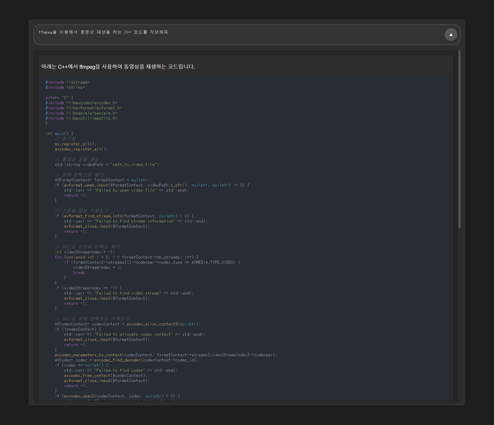

# QuickAsk for ChatGPT

QuickAsk is a streamlined, single-page application that simulates the experience of using ChatGPT. It leverages the OpenAI API to provide an interface where users can ask questions without waiting for the current answer to be completed, facilitating a continuous and fluid querying process.

## Features

- **Simple and Clean UI**: A user-friendly single-page application for ease of use.
- **Powered by OpenAI**: Integrates with the OpenAI API for reliable and intelligent responses.

## Prerequisites

Before you begin, ensure you have met the following requirements:

- You have an active OpenAI API key to interact with ChatGPT.

## Usage

To use QuickAsk for ChatGPT, follow these steps:

1. Clone/download the repository to your local machine.
2. Open `index.html` in a web browser.
3. Enter your OpenAI API key in the designated area.
4. Start asking your questions!

